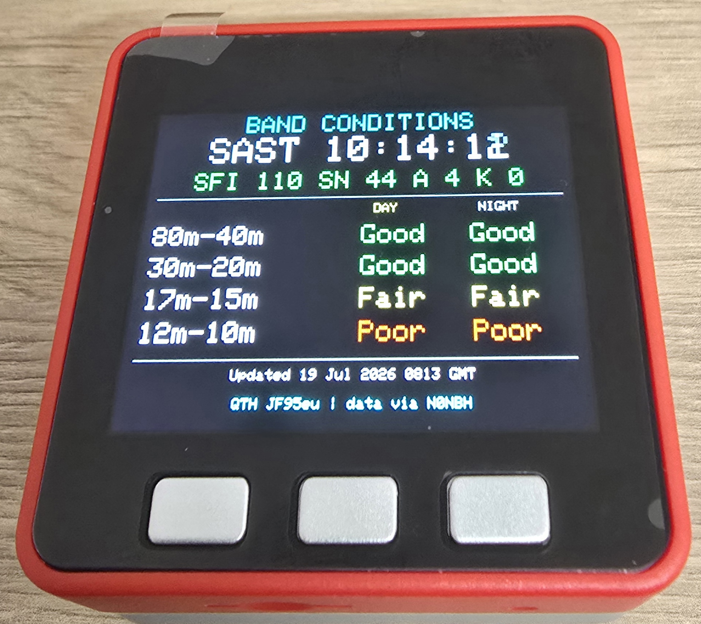
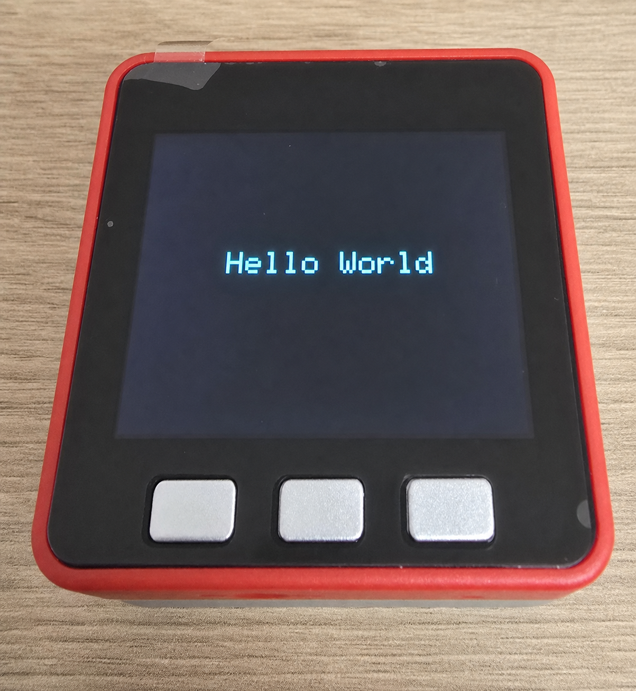
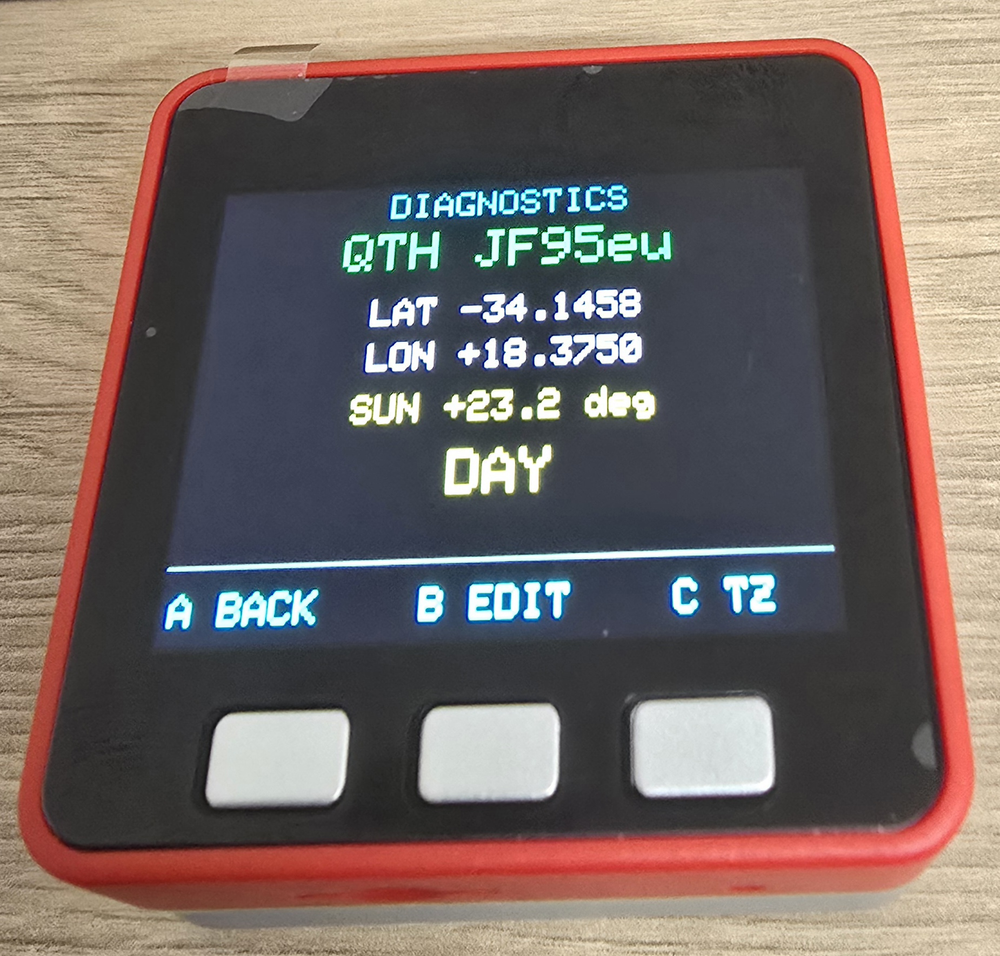
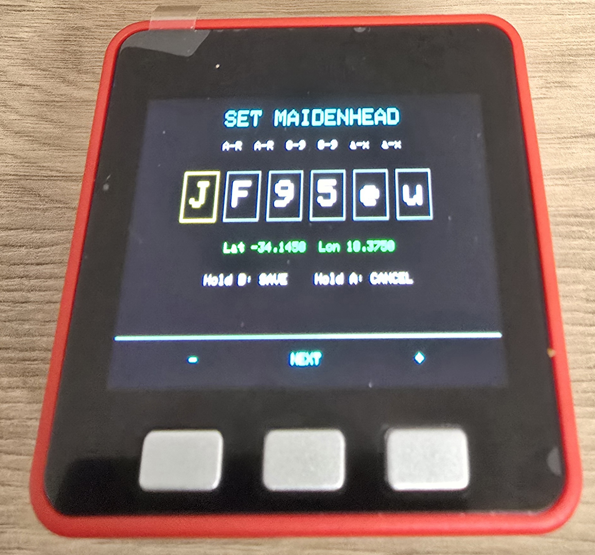
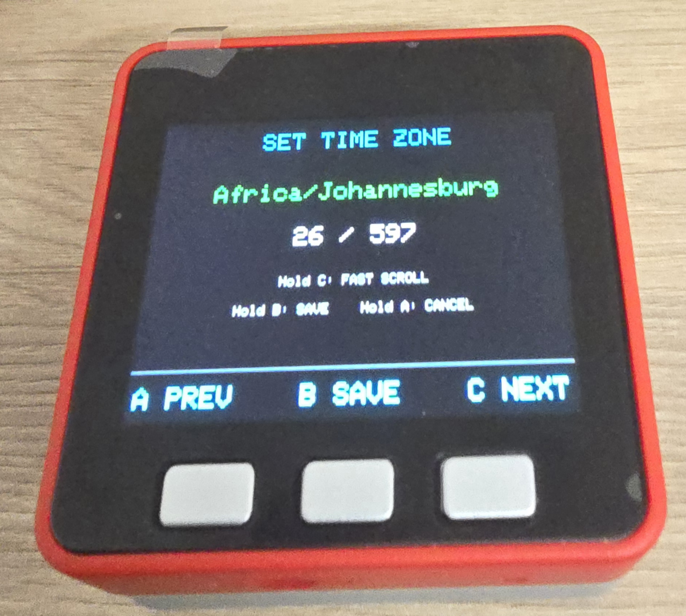

# M5Stack Fire Band Conditions Project
### by Georg Lerm - ZS1GFL
## Inspiration

This project was inspired by Hobby Steve's Facebook reel,
[“I'm lovng the ESP32!!!”](https://www.facebook.com/share/r/196b26DSr5/).
The reel presents a compact ESP32-driven round colour display showing key
amateur-radio propagation information, including SFI, K-index, and grouped HF
band conditions. It demonstrated how live solar data could become an immediate,
standalone operating aid rather than remain a web page that had to be checked
separately.

That concept was adapted to the M5Stack Fire and expanded with Wi-Fi and NTP,
Maidenhead-based location awareness, day/night calculations, selectable IANA
timezones, diagnostic and editing screens, persistent settings, and an RGB
power-saving mode.

## 1. Project overview

The project began as a PlatformIO Arduino firmware test for an M5Stack Fire.
Its first objective was simply to display a “Hello World” message and confirm
that the toolchain, USB connection, board definition, LCD, build process, and
firmware upload were all working correctly.

It developed into a self-contained amateur-radio information display. The
finished application connects to Wi-Fi, synchronizes its clock, downloads live
HF band-condition data, calculates location-dependent daylight information,
and presents the results on the M5Stack Fire LCD. Device settings can be edited
with the three front buttons and retained across reboots.

The firmware also includes an automatic power-saving mode that switches off
the LCD, slows the ESP32 processor, and uses the Fire's RGB LEDs as a dim
breathing status indicator.



*Figure 1: The completed dashboard running on the M5Stack Fire.*

## 2. Hardware and software platform

### Hardware

- M5Stack Fire with ESP32 dual-core processor
- 320 x 240 colour LCD
- Three front-panel buttons
- Ten built-in SK6812 3535 RGB LEDs on GPIO15
- Wi-Fi connectivity
- ESP32 non-volatile storage
- USB serial connection for programming and diagnostics

### Development environment

- PlatformIO
- Arduino framework for ESP32
- `m5stack/M5Stack` for the display, buttons, and device hardware
- `bxparks/AceTime` for IANA timezone handling
- `adafruit/Adafruit NeoPixel` for the SK6812 LEDs

The PlatformIO environment is named `m5stack-fire`, and the serial monitor runs
at 115200 baud.

## 3. Development progression

### 3.1 Display and board validation

The initial firmware displayed a basic test message on the LCD. This confirmed
that PlatformIO recognized the M5Stack Fire, the Arduino framework compiled,
the LCD initialized correctly, and firmware could be uploaded to the board.



*Figure 2: A reconstruction of the initial LCD validation milestone, rendered
from the completed-device photographs.*

Once the display test succeeded, the program became the foundation for the
band-conditions dashboard.

### 3.2 Wi-Fi and network time

Wi-Fi support was added with credentials stored in the ignored
`include/secrets.h` file rather than committed source code. A
`secrets.example.h` template documents the required definitions for another
installation.

Startup follows a visible sequence on the LCD:

1. Connect to Wi-Fi.
2. Confirm the connection and display the assigned address.
3. Wait one second for DHCP and routing to settle.
4. Request time from the preferred local NTP server on UDP port 123.
5. Fall back to public pool NTP servers when the local source is unavailable.

NTP requests use an explicit timeout so an unavailable server cannot block the
device indefinitely. The synchronized ESP32 system clock is then used by the
display, timezone conversion, solar-position calculations, and scheduled data
refreshes.

### 3.3 Live HF band conditions

The firmware downloads the N0NBH solar XML feed from HamQSL. It extracts:

- Solar Flux Index (SFI)
- Sunspot number (SN)
- A-index
- K-index
- Day and night condition ratings for grouped HF bands
- Feed update information

Band data is refreshed every 15 minutes. If a refresh fails, the last valid
data remains available and the program retries after one minute rather than
clearing the display.

The main dashboard was designed from the supplied reference image and refined
for readability on the 320 x 240 screen. SFI, SN, A, and K use consistent font
sizes. Band ratings are colour coded, while the clock includes its timezone
context.

## 4. Location and propagation context

### 4.1 Maidenhead locator support

The device uses a six-character Maidenhead locator as its station location.
The original default was `JF95eu`. The locator is decoded to the centre
latitude and longitude of its grid square.

The decoded coordinates are used to calculate solar elevation and decide
whether the station is currently in daylight or darkness. This selects the
applicable day or night propagation column instead of treating the feed as
fully location independent.

### 4.2 Locator editing and validation

The locator can be changed directly on the M5Stack Fire using its three
buttons. The editor restricts each character to the legal range for its
position:

- Characters 1–2: fields `A` through `R`
- Characters 3–4: digits `0` through `9`
- Characters 5–6: subsquares `a` through `x`

The complete value is validated again before saving. Valid locators are stored
in ESP32 non-volatile storage and restored after reboot. Invalid input is
rejected with an on-screen warning.

Button-release gates were added so the long middle-button press used to open
an editor cannot immediately trigger an action inside that editor. This fixed
the original behaviour where the locator screen appeared only momentarily and
then closed or changed state.

## 5. Screens and controls

### Dashboard

The dashboard displays:

- Current local time and timezone context
- SFI, sunspot number, A-index, and K-index
- Day and night ratings for grouped HF bands
- The currently applicable daylight state
- Data update status
- Active Maidenhead locator

### Diagnostics

The diagnostic screen was simplified for readability and uses larger text. It
shows:

- Active Maidenhead locator
- Decoded latitude and longitude
- Calculated solar elevation
- Current DAY or NIGHT decision

Network status, feed status, and last-fetch text were removed from this page so
the location calculation could be checked more easily.



*Figure 3: Maidenhead coordinates, solar elevation, and the resulting daylight
decision.*

### Locator editor

- Left button: decrement the selected character
- Middle button: advance to the next character
- Right button: increment the selected character
- Hold middle: validate and save
- Hold left: cancel



*Figure 4: The on-device six-character Maidenhead editor and decoded position.*

### Timezone editor

- Left button: previous timezone
- Right button: next timezone
- Hold right: fast scrolling
- Hold middle: save
- Hold left: cancel



*Figure 5: Selecting an IANA timezone from the firmware-resident catalogue.*

## 6. Timezone support

The initial fixed timezone was expanded into a device-selectable timezone
system. AceTime provides a firmware-resident catalogue of approximately 597
IANA zones and aliases.

The selected stable zone identifier is saved in ESP32 non-volatile storage and
restored during startup. Time conversion and daylight-saving changes are
therefore handled automatically for the selected region. The timezone list
fits in firmware flash, so an SD card is not required for this feature.

## 7. Code refactoring and architecture

The early implementation concentrated most behaviour in `main.cpp`. It was
later split into focused modules with headers, implementation files, and
comments:

- `main.cpp` coordinates startup, screens, buttons, and application events.
- `DisplayUi` contains LCD rendering and layout code.
- `NetworkTimeService` handles Wi-Fi and NTP synchronization.
- `SolarDataService` downloads, parses, caches, and schedules solar data.
- `StationLocation` validates, stores, and decodes Maidenhead locators and
  calculates solar elevation.
- `TimeZoneSettings` manages the IANA catalogue, local-time conversion, and
  persistent timezone selection.
- `PowerSaveManager` manages inactivity, LCD sleep and wake, RGB animation, and
  CPU-frequency changes.
- `AppConfig.h` centralizes hardware pins, timeouts, refresh periods, URLs, NVS
  keys, brightness values, and other application policy.

This separation makes screen layout, networking, calculations, persistent
settings, and hardware power control easier to read and change independently.

### Project directory tree

```text
m5-fire-bandconditions/
|-- images/
|   |-- Diagnostic.jpg
|   |-- Hello_World.png
|   |-- Home_Page.jpg
|   |-- MH_Edit.jpg
|   `-- TZ.jpg
|-- include/
|   |-- AppConfig.h
|   |-- DisplayUi.h
|   |-- NetworkTimeService.h
|   |-- PowerSaveManager.h
|   |-- SolarDataService.h
|   |-- StationLocation.h
|   |-- TimeZoneSettings.h
|   |-- secrets.example.h
|   `-- secrets.h              (local and ignored)
|-- src/
|   |-- DisplayUi.cpp
|   |-- NetworkTimeService.cpp
|   |-- PowerSaveManager.cpp
|   |-- SolarDataService.cpp
|   |-- StationLocation.cpp
|   |-- TimeZoneSettings.cpp
|   `-- main.cpp
|-- .gitignore
|-- platformio.ini
|-- README.md
|-- report.md
|-- project.pdf
`-- todo.md
```

PlatformIO's generated `.pio/` build directory and repository/tool metadata
directories are intentionally omitted from this review tree.

## 8. Power-saving feature

An inactivity-based power-saving mode was added for battery operation.

When the configured timeout expires:

1. The LCD backlight is set to zero.
2. The LCD controller enters sleep mode.
3. The ESP32 CPU frequency is reduced from 240 MHz to 80 MHz.
4. The ten SK6812 LEDs begin a slowly rotating rainbow breathing animation.

The LED data pin is explicitly returned to `OUTPUT_OPEN_DRAIN` after each
transmission, following the M5Stack Fire hardware recommendation for GPIO15.

Pressing any front button stops and clears the LEDs, restores the normal CPU
frequency, wakes the LCD, and restores its brightness. The wake press is
consumed until all buttons are released so it cannot accidentally open a menu
or alter a setting.

If no button is pressed for a further 60 seconds while in power save, the
device performs a total shutdown. Wi-Fi is disconnected, the LCD wakes to show
a "SHUTTING DOWN" message for ten seconds, and the ESP32 then enters deep
sleep. The physical power button (hardware reset) is the only way to restart
it, giving the longest possible battery life when the device is left idle.

At the time of this report, the current local configuration is:

- Display sleep timeout: 120 seconds
- Total-shutdown delay after power save: 60 seconds
- Shutdown message duration: 10 seconds
- Maximum sleep-animation LED brightness: 2%
- Breathing cycle: 8 seconds
- LED update interval: 40 ms
- LCD wake brightness: 80/255
- Power-save CPU frequency: 80 MHz

The 2% LED brightness is a current local tuning change; this report does not
alter or commit it.

## 9. Reliability and safety measures

The finished firmware includes several defensive behaviours:

- Wi-Fi, NTP, and feed requests use timeouts.
- NTP has preferred-local and public fallback sources.
- Failed solar refreshes preserve the last successful data.
- Invalid Maidenhead locators cannot be saved.
- Locator and timezone settings survive reboot in NVS.
- Hold and release gates prevent button actions from leaking between screens.
- Wake-button input is consumed before normal controls resume.
- The device fully shuts down (deep sleep) after a prolonged idle power-save
  period, disconnected from Wi-Fi, so it does not drain the battery
  indefinitely.
- PSRAM initialization and automatic SD-card mounting are disabled because the
  application needs neither; this avoids startup errors on units with
  unreliable PSRAM or without a readable card.
- Configuration assertions reject invalid LED brightness percentages or a zero
  sleep timeout at compile time.
- Wi-Fi credentials remain in an ignored private header.

## 10. Verification performed

Development was repeatedly verified on the actual M5Stack Fire rather than by
compilation alone. Checks included:

- PlatformIO builds of the complete Arduino firmware
- USB uploads through the detected COM port
- Initial LCD “Hello World” output
- Wi-Fi connection and address display
- NTP synchronization and fallback behaviour
- Live N0NBH data retrieval
- Dashboard and diagnostic layout readability
- Maidenhead editing, validation, saving, and reboot persistence
- Timezone selection, saving, and local-time display
- LCD sleep and button wake behaviour
- RGB breathing animation and LED shutdown on wake
- CPU-frequency reduction and restoration logic

The power-saving build completed successfully with approximately 1.1% of the
available RAM and 16.9% of the configured flash partition in use.

## 11. Final result

The completed project is a practical M5Stack Fire amateur-radio dashboard. It
combines live propagation data with an accurate local clock, station-location
awareness, persistent user configuration, diagnostic information, and a
battery-conscious idle mode.

The firmware is modular and documented, and the most likely future additions
have been recorded separately in `todo.md`. Those ideas include an NCDXF beacon
screen, target-locator calculations, greyline tools, enhanced NOAA space
weather, observed propagation reports, operating alerts, configuration through
a local web page, optional SD-card history, and satellite-pass information.

The project source code is available on request by email at
[zs1gfl@gltech.co.za](mailto:zs1gfl@gltech.co.za?subject=Code%20Request%3A%20M5Stack%20Fire%20Band%20Conditions),
using the subject **Code Request: M5Stack Fire Band Conditions**.
